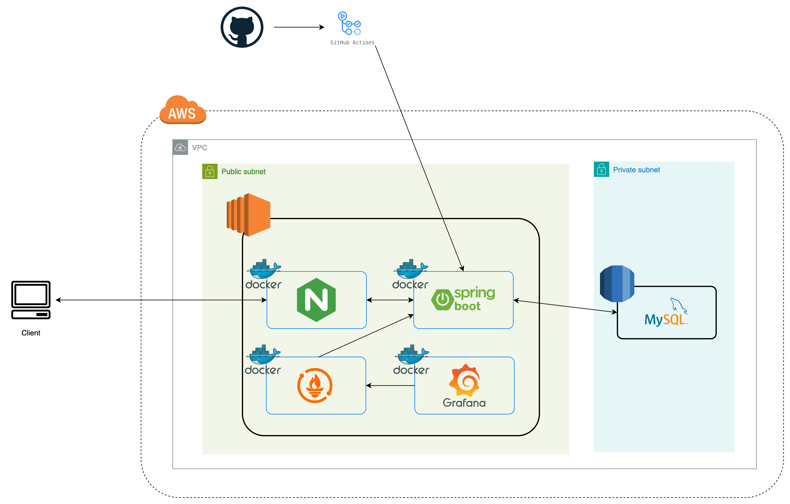

# 🎓 대학교 동아리 커뮤니티 앱

## 📌 Problem & Solution

- **문제점**: 검증된 대학교 동아리 목록이 정리된 곳이 없다.  
  → ✅ **해결**: 검증된 동아리 목록 제공
- **문제점**: 학기마다 공지 단톡방을 개설하고 동아리원들을 관리해야 한다.  
  → ✅ **해결**: 동아리 가입 및 공지사항 작성 기능 제공

---

## 🏛️ Architecture

### 🔹 Infrastructure



---

## Directory Structure

```
📂 circleon 
├── 📂 authentication # JWT 및 이메일 인증 관련 모듈 
├── 📂 common # 공통 유틸리티 및 예외 처리 
├── 📂 config # 애플리케이션 설정
└── 📂 domain # 주요 비즈니스 로직 
    ├── 📂 admin # 관리자 기능 
    ├── 📂 circle # 동아리 관련 로직 
    ├── 📂 post # 게시글 관련 로직 
    ├── 📂 schedule # 일정 관리 기능 
    └── 📂 user # 사용자 관련 기능
```

---

## 🛠 Tech Stack

### 🎯 Backend
            

### 🗄️ Database & Cache
 

### ☁️ Cloud & DevOps
    
 

### 🖼️ Image Processing


---

## ✨ Features

### 🔐 인증 및 보안
- 대학 이메일 인증을 통한 회원가입 및 로그인
  - 이메일 전송 기능 비동기 처리
- JWT 기반 인증
- **Access Token / Refresh Token** 방식 사용

---

### 🏛️ 동아리 기능
- 동아리 생성, 수정, 삭제
- 동아리 가입 신청 / 승인 / 거절 / 탈퇴
- **공식 / 비공식** 동아리 인증 요청 및 관리
- **동아리 권한 계층**
  - 회장: 전체 관리 권한
  - 임원: 일부 관리 권한
  - 일반 동아리원: 읽기 및 제한된 쓰기 권한
- 동아리원 목록 조회 및 권한 부여 / 변경 / 회수

---

### 📢 게시판 & 게시글
- 동아리별 게시판 운영
- **동아리원만 접근 가능** (비회원은 게시판 비공개)
- 게시글 작성, 수정, 삭제
- 댓글 작성, 수정, 삭제

---

### 👤 마이페이지
- 내가 작성한 **게시글 / 댓글 전체 목록** 조회
- 내가 가입한 동아리 및 신청 현황 확인

---

### 🚨 신고 기능
- **게시글 신고**: 부적절한 게시글 신고
- **댓글 신고**: 부적절한 댓글 신고
- **동아리 신고**: 부적절한 동아리 신고

---

### 🛠️ 관리자 기능
- 동아리 신고 목록 조회 및 처리 
- 공식 동아리 인증 요청 승인 / 거절

---

### 🖼️ 이미지 처리
- 업로드 이미지 리사이징 및 최적화 (`Thumbnailator`)
- 업로드 이미지 용량 제한 및 예외 처리
- **CDN + Signed URL 기반 이미지 접근 제어**
  - 이미지 업로드 후, **CloudFront CDN**을 통해 서빙
  - **동아리원 여부 검증** 후에만 Signed URL 발급
  - Signed URL은 **만료 시간** 설정으로 일정 시간만 유효
  - **CDN의 Cache-Control max-age**와 **만료 시간**을 동기화하여,
    - 일정 시간 동안 동일한 Signed URL 제공
    - 불필요한 재생성 방지 및 캐시 효율 최적화

## 👨‍💻 Contributor

| 주명하 |
|:---:|
| <a href="https://github.com/myeongha" target="_blank"></a> <br/> <a href="https://github.com/myeongha" target="_blank"></a> |
